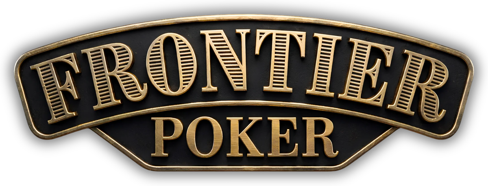

  

A lightweight, browser-based Texas Hold'em career game set in the Old West. Play against five adaptive AI legends across four towns in an engine driven by real-time hand simulations, pot odds, and behavioral tracking, with zero accounts, ads, or network telemetry.

**Play at:** **[https://frontier.ivaylokrastev.com](https://frontier.ivaylokrastev.com)**

---

## AI Opponents & Decision Engine

The core of Frontier Poker is its honest, non-cheating AI. Opponents cannot see your cards or read hidden deck data. Instead, they make decisions using a multi-stage reasoning pipeline:

1. **Monte Carlo Hand Simulation:** On every street, an opponent simulates hundreds of potential outcomes for the remaining deal to determine their exact hand strength and draw potential relative to the board.
2. **Pot Odds & Value Evaluation:** The simulated win probability is compared directly against the price to call or raise, establishing a baseline mathematical decision.
3. **Temperament Filtering:** The raw mathematical result is filtered through the character's unique risk tolerance, bluff frequency, and play style.
4. **Behavioral Memory:** Opponents track your VPIP (Voluntarily Put Money In Pot), raise frequency, and showdown history across tournament sessions, adapting their aggression and bluff-calling thresholds specifically against you.

### Legendary Personalities

* **Wild Bill Hickok:** Plays a wide range of starting hands and bets aggressively. Hard to place on a range.
* **Poker Alice:** Highly disciplined and odds-driven. Folds weak draws and rarely bluffs without strong equity.
* **Doc Holliday:** Patient and fold-heavy pre-flop, but transitions into hyper-aggressive counter-attacks when interested in a pot.
* **Calamity Jane:** Passive calling station. Frequently calls to see showdowns, making bluffs ineffective against her.
* **Bat Masterson:** The tracker. Watches your betting patterns more closely than the other AI, actively profiling your tightness and aggression over time.

---

## Game Overview & Career Mode

Start in **Deadwood** with a $200 bankroll and a $50 buy-in. Compete in 6-player single-table tournaments where 1st place earns 50% of the pool, with 2nd and 3rd splitting the rest. Build your bankroll to unlock higher-stake venues: **Dodge City**, **Tombstone**, and **Denver**.

* **Achievements:** Earn 20 trackable career achievements as you progress through the towns.
* **Autosave:** Game state, tournament progress, and opponent memories save continuously to local storage.

---

## Player Tools & Telemetry

* **Odds Calculator:** Displays your live win probability, potential hand draws, and pot-odds value assessments during a hand.
* **Play Style Analysis:** Profiles your play on Tight–Loose and Passive–Aggressive sliders based on your action history.
* **Comprehensive Stats:** Tracks earnings, biggest pots won, winning hand types, and a street-by-street breakdown (folds, checks, calls, raises) comparing your tendencies directly against each AI character.
* **In-Game Guide:** Quick reference for hand rankings, rules, position play, and fundamental strategy.

---

## Installation & Privacy

* **Privacy-First:** All code runs client-side. No accounts, external server requests, ads, or tracking.
* **Install as PWA:**
  * **iOS (Safari):** Tap **Share** $\rightarrow$ **Add to Home Screen**
  * **Android (Chrome):** Tap **Menu** $\rightarrow$ **Install** / **Add to Home Screen**

---

## License

© Ivaylo Krastev. All rights reserved. Unauthorised copying, distribution, or modification is prohibited.